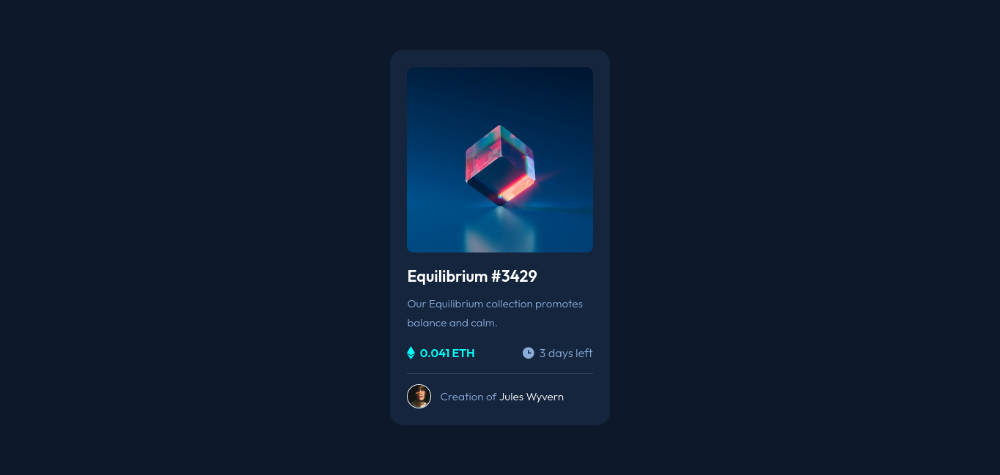

# Frontend Mentor - NFT preview card component solution

This is a solution to the [NFT preview card component challenge on Frontend Mentor](https://www.frontendmentor.io/challenges/nft-preview-card-component-SbdUL_w0U). Frontend Mentor challenges help you improve your coding skills by building realistic projects.

## Table of contents

- [Overview](#overview)
  - [The challenge](#the-challenge)
  - [Screenshot](#screenshot)
  - [Links](#links)
- [My process](#my-process)
  - [Built with](#built-with)
  - [What I learned](#what-i-learned)
  - [Useful resources](#useful-resources)
- [Author](#author)
- [Acknowledgments](#acknowledgments)

## Overview

### The challenge

Users should be able to:

- View the optimal layout depending on their device's screen size
- See hover states for interactive elements

### Screenshot

### Links

- Solution URL: [Frontend Mentor Solution](https://www.frontendmentor.io/solutions/nft-preview-card-using-css-r44NA7jDpm)
- Live Site URL: [Live Site at Github Pages](https://indrasaputraidrus.github.io/nft-preview-card/)

## My process

### Built with

- Semantic HTML5 markup
- CSS custom properties
- Flexbox
- Mobile-first workflow

### What I learned

I learned how to make image overlay when hover

### Useful resources

- [image overlay](https://www.w3schools.com/howto/howto_css_image_overlay_icon.asp) - This helped me for making overlay image hover

## Author

- Github - [Indra Saputra Idrus](https://github.com/IndraSaputraIdrus)
- Frontend Mentor - [@IndraSaputraIdrus](https://www.frontendmentor.io/profile/IndraSaputraIdrus)
